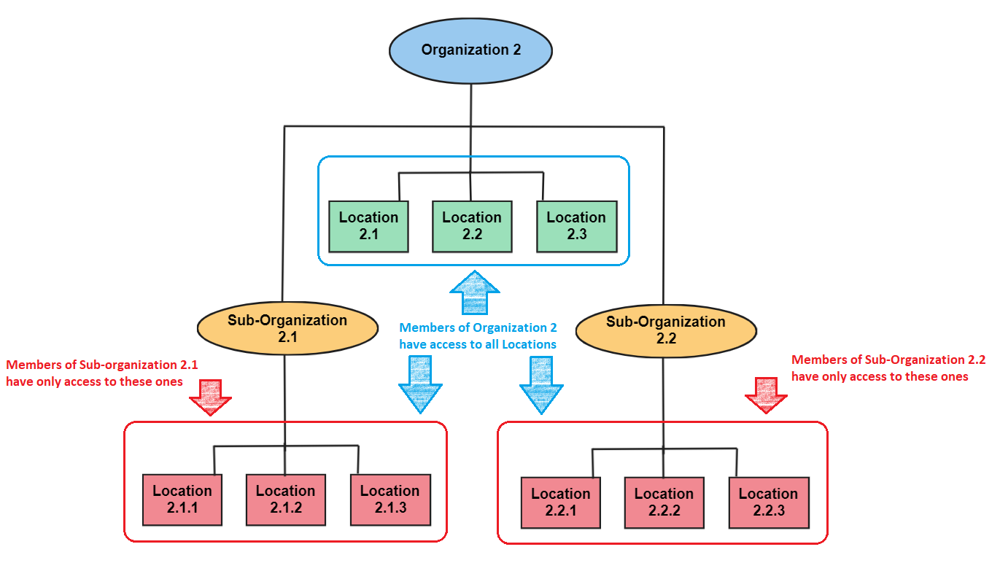
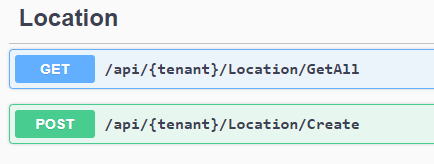

# Multitenant App
This is an example of a multitenant app. **Some part of the code requires changes before using in a production environment.**

## Restricting items by tenant
You're developping an solution to keep the same application available for multiple clients. Each client should have only access to his corporation and subgroups in there. 
The only thing you have to do is use this interface **IHaveHierarchicalTenant** on your entities to have this behaviour.

Checking this image below, we can see that **Organization 1** should have only access to three locations *1.1, 1.2 and 1.3*. 


But, members of **Organization 2** should have access to nine locations: three locations of **Organization 2** and all locations of **sub-organization 2.1** and **sub-organization 2.2**.



## Sharing items inside a tenant.
Maybe your tenant has some entities that should be shared with all children tenants. For that, you have to use **ISharedInTenant** interface on your entites. 
Then, you can see that a service available in a *Organization* will be seen for all *sub-organizations*.


# Running the application

Starting the application the DataBase will be seeded with some data for *tenants* and *locations*. In the seed, only *Organization 2* has sub-organizations.

*Tenant* field is an unique organization code. 



## Making requests
Each Organization is identified by *org* followed by his identifier number. So, for *organization 1*, you should use *org1*. 

Request:
```
[GET] https://localhost:7174/api/org1/Location/GetAll
```

Response:
```json
[
  {
    "tenantKey": "1.",
    "address": "address location 1.1",
    "id": 1,
    "name": "location 1.1",
    "isDeleted": false
  },
  {
    "tenantKey": "1.",
    "address": "address location 1.2",
    "id": 2,
    "name": "location 1.2",
    "isDeleted": false
  },
  {
    "tenantKey": "1.",
    "address": "address location 1.3",
    "id": 3,
    "name": "location 1.3",
    "isDeleted": false
  }
]
```

For sub-organizations, it's almost the same. They're identified by *sub[orgId]-[subId]* where *orgId* is its organization identifier and *subId* is sub-organization identifier. So, for use *Sub-organization 2.1*, you have to inform *sub2-1*.

Request:
```
[GET] https://localhost:7174/api/sub2-1/Location/GetAll
```

Response:
```json
[
  {
    "tenantKey": "2.3.",
    "address": "address location sub2-1.1",
    "id": 4,
    "name": "location sub2-1.1",
    "isDeleted": false
  },
  {
    "tenantKey": "2.3.",
    "address": "address location sub2-1.2",
    "id": 5,
    "name": "location sub2-1.2",
    "isDeleted": false
  },
  {
    "tenantKey": "2.3.",
    "address": "address location sub2-1.3",
    "id": 6,
    "name": "location sub2-1.3",
    "isDeleted": false
  }
]
```

# Migration
You can modify the code and add a new migration using a command like that in VS
```powershell
Add-Migration [MigrationName] -Project MultiTenant.Repository -StartUpProject MultiTenant.App
```